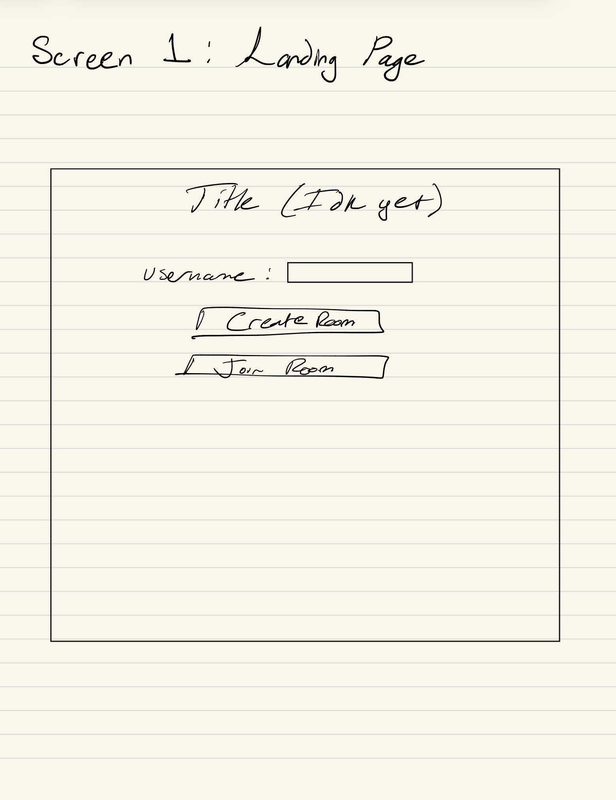
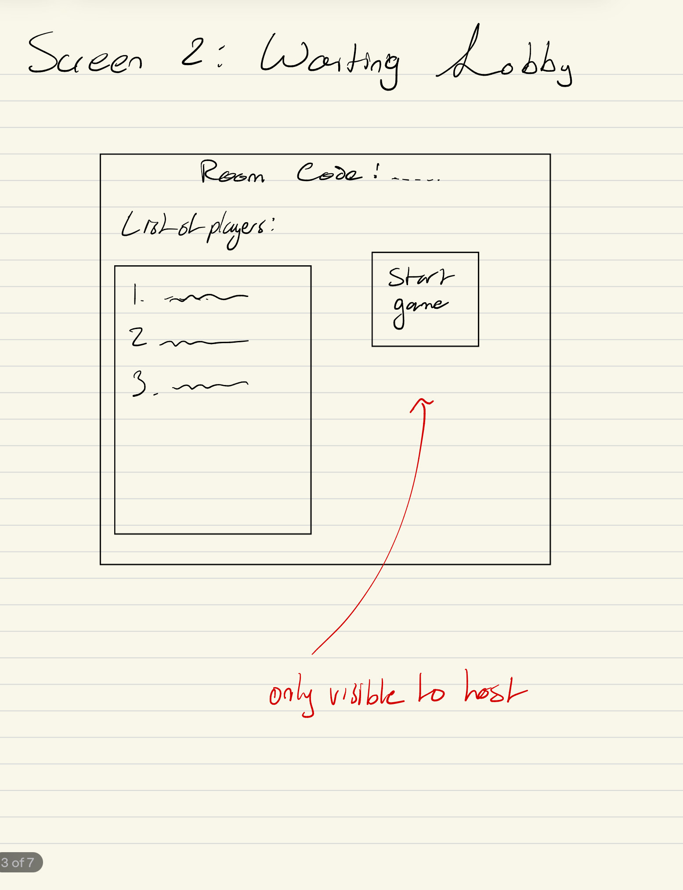
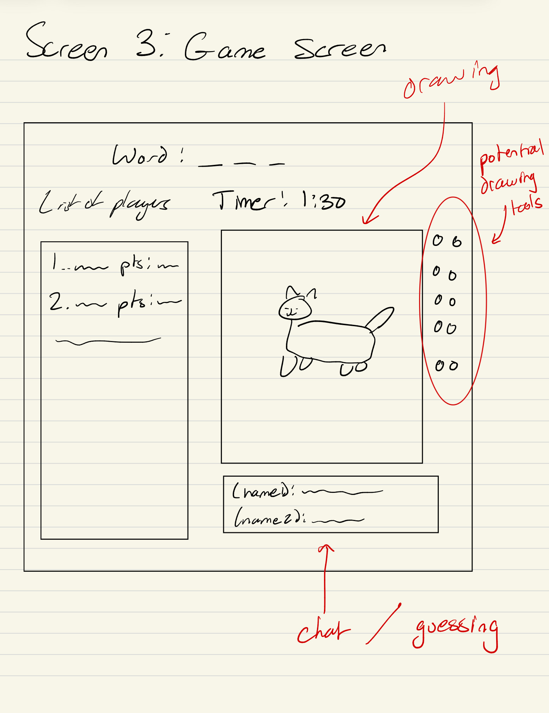
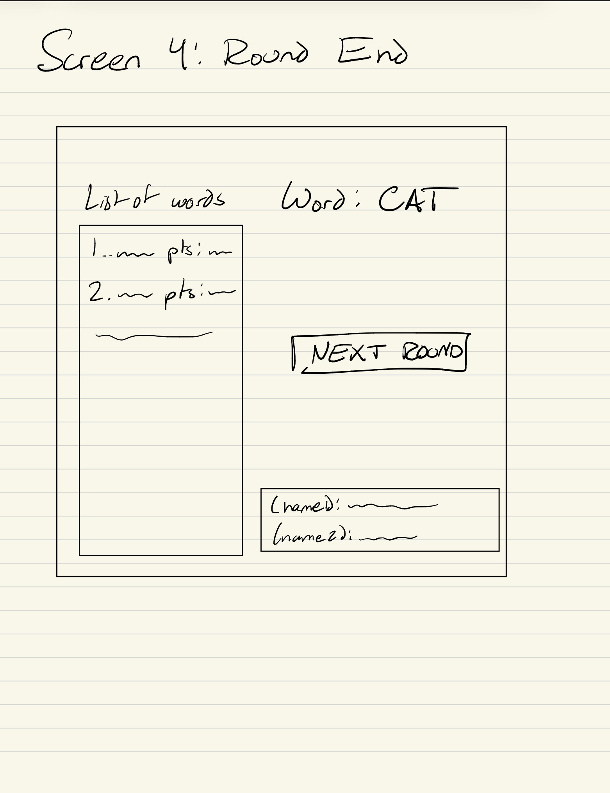
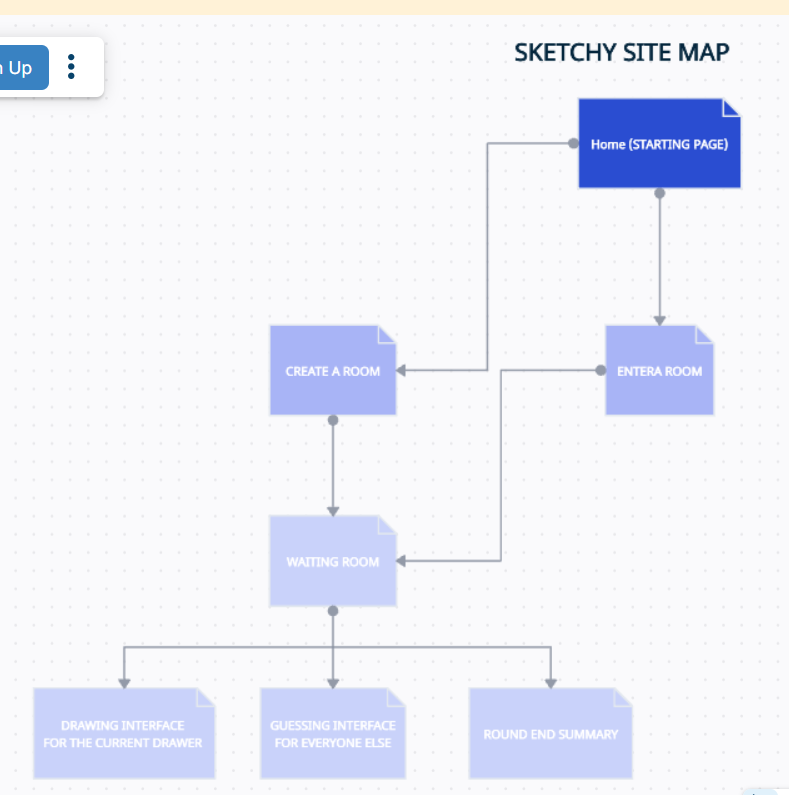

The content below is an example project proposal / requirements document. Replace the text below the lines marked "__TODO__" with details specific to your project. Remove the "TODO" lines.

(__TODO__: your project name)

# Sketchy 

## Overview

(__TODO__: a brief one or two paragraph, high-level description of your project)

Skribbly will be an web app that allows multiple people to enter a room and take turns drawing something from a selection of words. The remaining players try to guess what the word is. Once all players have taken a turn, the points are tallied up. Essentially, it attempts to be a skribble.io remake from scratch.

## Data Model

(__TODO__: a description of your application's data and their relationships to each other) 

The application will store Users and games

* users can have multiple games that they hosted or partook in (via references)
* each game will hold info of players, chat logs, and drawing logs (via embedding)

(__TODO__: sample documents)

An Example User:

```javascript
{
  username: "shannonshopper",
  hash: // a password hash,
  gamesplayed: //number
  TotalScore: //number
  wins: //number
} //a player will contain a reference to a user when in a game, only difference is theres a CURRENT score and HASGUESSED attached to it
```

An Example game with Embedded Items:

```javascript
{
  hostuserID: // a reference to a User object
  roomcode: "GAME42", //string with no special characters
  players: [
    { name: "player2", score: "50", correct: false, wins: 0, ....},
    { name: "player3", score: "100", correct: true, wins: 3, ....},
  ],
  CurrentDrawerID: // a reference to a user
  currentWord: "cat" //string
  round: 2,
  drawingData: {
    x: //coord
    y: //coord
    tool: //eraser or pen
  }
  chatHistory: {
    userID: //reference to a user
    message: "dog" //a guess
    isCorrect: false //if ts incorrect
  }
  ... //some possible other important things to track I cannot forsee right now
}
```


## [Link to Commented First Draft Schema](db.mjs) 

(__TODO__: create a first draft of your Schemas in db.mjs and link to it)

## Wireframes

(__TODO__: wireframes for all of the pages on your site; they can be as simple as photos of drawings or you can use a tool like Balsamiq, Omnigraffle, etc.)

/sketchy - Page for creating username and entering to joining a room



/sketchy/:roomNameSlug - page for waiting for all players to enter



/sketchy/:roomNameSlug/:RoundNumber - page for guessing and drawing



/sketchy/:roomNameSlug/:RoundNumber - page for end of guessing and drawing



## Site map

(__TODO__: draw out a site map that shows how pages are related to each other)

 I added this as an image because the website is being annoying

## User Stories or Use Cases

(__TODO__: write out how your application will be used through [user stories](http://en.wikipedia.org/wiki/User_story#Format) and / or [use cases](https://en.wikipedia.org/wiki/Use_case))

1. as non-registered user, I can register a new account with the site
2. as a user, I can enter a room and be a player or create a room and be a host
3. as a host, I can create start the game when ready or move on to the next round when ready from the round end screen
4. as a drawer, I can select a word from a list of possibilities
5. as a drawer, I can draw the word I selected
6. as a guesser, I can type in the chat to guess the word

## Research Topics

(__TODO__: the research topics that you're planning on working on along with their point values... and the total points of research topics listed)

* (6 points) react 
  * I will use this to make the game interface manageable
* (4 points) use socket.io for real time communication
  * this will be essential for drawing strokes on the canvas, chat messages, turn changes, and scores because they must sync across all clients
* (4 points) use canvas for the drawing component
  * This will be required for the entire drawing, it will not be possible without it

10 points total out of 8 required points (___TODO__: addtional points will __not__ count for extra credit)


## [Link to Initial Main Project File](app.mjs) 

(__TODO__: create a skeleton Express application with a package.json, app.mjs, views folder, etc. ... and link to your initial app.mjs)

## Annotations / References Used

(__TODO__: list any tutorials/references/etc. that you've based your code off of)

So far I have not used any tutorials beyond past homework exercises. I plan to use these: 
* [socket.io] (https://socket.io/docs/v4/tutorial/introduction)
* [react] (https://www.w3schools.com/REACT/DEFAULT.ASP)
* [canvas] (https://developer.mozilla.org/en-US/docs/Web/API/Canvas_API/Tutorial)

